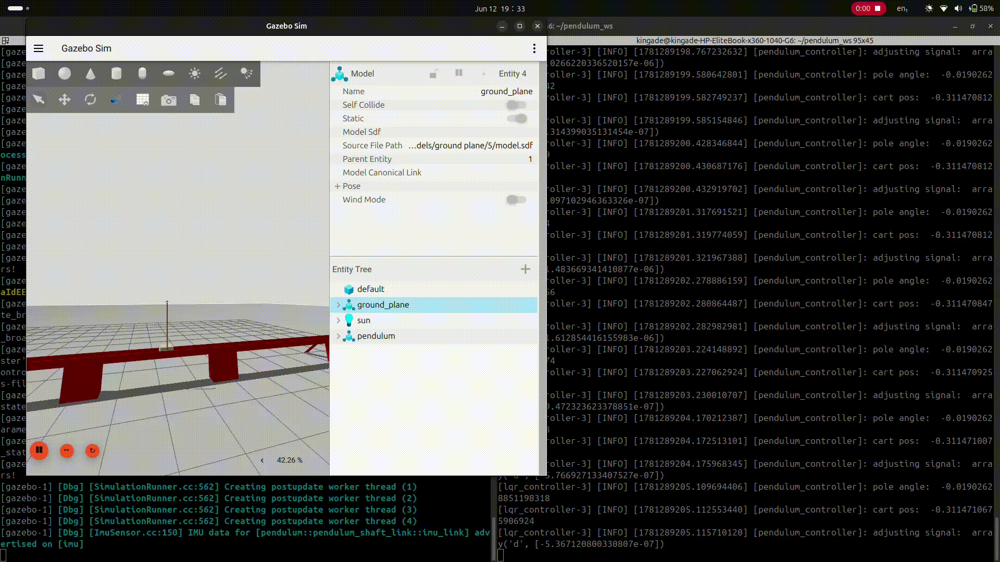

# Tyr
A Cart-Pole Stabilization Project



This project is a ROS-based implementation and simulation of the famous cart-pole stabilization problem in **control theory**. This is a brief introduction and usage and installation guide for this project. A longer, more technical explanation of the project can be found [here]().

Tyr assumes all states can be directly measured and doesn't model sensor noise for now. While all states can be measured- a potentiometer/encoder for cart position, doppler radars for cart velocity, 
a rotary encoder for pole angular position and a gyroscope or IMU for pole angular velocity- this is rarely ever done in practice. Derivative states are usually obtained using [observers]() leaving only the cart position and pole angular position to be measured directly by sensors. This project was purposely architectured this way for simplicity when debugging, and would incorporate these and state estimation in future releases.

#

<a name=packages></a>
### Packages
Tyr includes 2 packages: description and control. They are explained below:

**System Description (pendulum_description)**
This package contains the cad files and urdf descriptions for the cart-pole system. It also contains a world directory for the gazebo setup. The system by nature doesn't interract with anything, so an empty world is used. 

**Control Files (invpendulum_description)**
This contains the files that stabilize the systen. Currently, there are 2 control algorithms- PID and LQR. Both feature an energy-based swing up controller. The LQR gain matrix was gotten from MATLAB, more can be found [here](). The PID gains were manually tuned, but due to recent changes in parameters, they may fail to stabilize the system; it will be retuned in further releases. The swing up controller is also a work in progress for now, and would be completed in future releases.


<a name=installation></a>
### Installation Guide
**Prerequisites**
1) This was created and tested on an Ubuntu 24.04 OS, using ROS2 jazzy. Using another version of ROS2 or a different operating system may cause errors I'm not familiar with. If so, feel free to report as an issue on this repo.
#

**Installation**
1) Create a workspace (directory/folder) for the codebase. 
```bash
mkdir <workspace_name> 
cd <workspace_name>
#Replace <workspace_name> with a name of your choice. Eg. bumperbot_ws
```
#

2) Clone this repo in that directory.
```bash
git clone https://github.com/kogodemilade/Tyr--Cart-Pole-control/
```
#

3) Install python and ros dependencies.
```bash
#Python dependencies
pip install -r requirements.txt
#Missing ros packages
rosdep install --from-paths src --ignore-src -r -y
```
#
4) Build repository.
```bash
colcon build
```
#

### Usage
The first step whenever opening a terminal or a terminal tab is to source ros and source the project in question.
```bash
#Source ros
. /opt/ros/jazzy/setup.bash

#source current project (bumperbot_ws, replace with your directory file path)
cd ~/path/to/project && . install/setup.bash
```
In practice, sourcing the current project is usually enough, although I've found that sometimes sourcing both fix weird errors once in a while.

I suggest creating an [alias](https://askubuntu.com/questions/17536/how-do-i-create-a-permanent-bash-alias) since these commands are used very frquently.

All packages must run in separate terminal tabs, so I recommend [Terminator](https://gnome-terminator.org/), which allows splitting tabs using Ctrl+shift+E (horizontal split) and Ctrl+shift+O (Vertical splits). This makes it easy to monitor multiple processes in prallel.
Both packages can be launched using ('app' is a placeholder)
```bash 
ros2 launch pendulum_<pkg> app.launch.py
```

I can't quite figure out how to begin gazebo paused yet, or some other mechanism that holds the rod upright in place before the controller takes over, so the two packages must be launched in quick succession.
